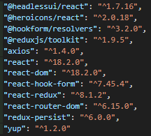

# Pokédex App

Welcome to the Pokédex App repository! This web application is built using React, TypeScript, and Vite, allowing you to explore a vast collection of Pokémon. You can view all the available Pokémon, add them to your favorites list

## Table of Contents

- [Prerequisites](#prerequisites)
- [Installation](#installation)
- [Usage](#usage)
- [Screenshots](#screenshots)
- [Features](#features)
- - [List All Pokémon](#list-all-pokémon)
- - [Add to Favorites](#add-to-favorites)
- - [User Login](#user-login)
- [Libraries](#libraries)

## Prerequisites

Before you begin, ensure you have the following installed:

- Node.js (version 14.17.1 or upper)
- npm (version 6.14.13 or upper)

## Installation

To get started, follow these steps:

1. Clone this repository to your local machine.
2. Navigate to the project directory: `cd pokemon-explorer-app`.
3. Install the project dependencies: `npm install`.

## Usage

To run the application, execute the following command:

```bash
npm run dev
```

This will start the development server. Open your browser and navigate to `http://localhost:3000` to access the Pokémon Explorer App.

## Screenshots

Screenshots of the application can be found [here](link-to-your-screenshots).

## Features

### List All Pokémon

- View a comprehensive list of all available Pokémon.
- Access details about each Pokémon, such as their name, type, and abilities.

### Add to Favorites

- Add your favorite Pokémon to a dedicated favorites list.
- Easily manage and view your favorite Pokémon at any time.

### User Login

- Log in to access additional features and personalized experiences.
- Securely manage your favorite Pokémon list and account settings.

### Missing Features

- Add pokemos to favorite list (bugged).
- Show menu and login data only inside the app.
- Navigate to previues pokemon list.

## Libraries

